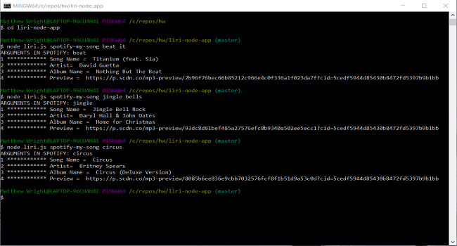

# :iphone: Liri-Node-App

### Overview
LIRI is like iPhone's SIRI. However, while SIRI is a Speech Interpretation and Recognition Interface, LIRI is a Language Interpretation and Recognition Interface. LIRI is a command line node app that takes in parameters and gives you back data.

### Functionality

This app utilizes Node.js   Run the commands from the terminal.

Here is a list of the 4 actions liri-node-app can do:
  1. "node liri.js my-tweets" : will return the 20 most recent tweets with a timestamp
  2. "node liri.js spotify-my-song <songname>" : will return you song along with extra information about artist, etc.
  3. "node liri.js movie-this <movie name>" : will return information about that movie
  4. "node liri.js do-what-it-says" : will return a secret that is hidden in text file suing the fs.node package.

### Technology
* API calls: Twitter, Spotify and OMBD
* JavaScript: Functional program for logic
* .env: to keep API keys secure
 

<!-- ### Video Link
<strong>[Bamazon store app video demonstration](https://drive.google.com/open?id=1myM5Ycymp9T8ULY79YtZSIFycjTSSPl3)</strong> -->

### Screenshot

